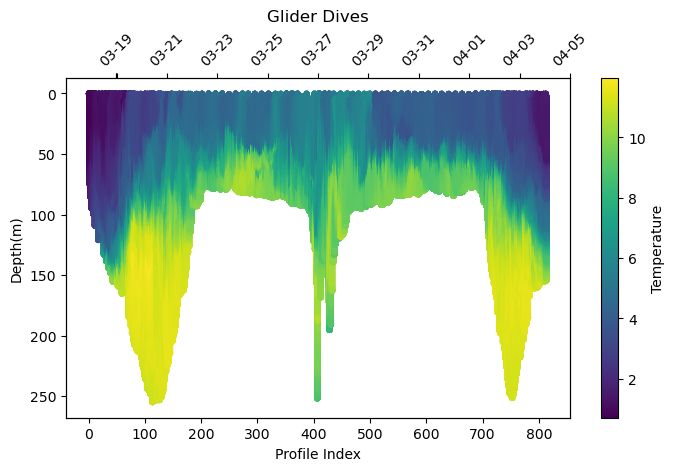

# Slocum Glider Python Processing Toolbox

This is a minimal glider processing toolbox using Python to go from Slocum glider raw data files to self-describing `*.nc` files, that pass [compliance checking](https://compliance.ioos.us/index.html "compliance checking") with the US Integrated Ocean Observing System (US-IOOS) Glider Data Acquisition Centre (GDAC). The `*.nc` files from this toolbox should pass requirements to be ingested into the Global Telecomunications System (GTS) for further use in models. We follow the US IOOS guidelines for file format and structure of glider data.

The intent of this toolbox is to produce a clean data set from raw glider data for sharing with data centres and for further careful scientific post-processing (expert processing), by preserving the original data resolution and associated metadata. This toolbox does not do enhanced checks for data Quality Control (QC).

This toolbox seperately supports both `realtime` (while glider is deployed) and `delayed` data mode (after glider is recovered). The user can tell the toolbox which mode to use. The processing levels in both modes are the same, but `delayed` mode will contain the complete dataset while `realtime` may not.

<!-- ## ISSUES
- some metadata fields not properly updated or calculated in profile/trajectory file
- some compliance issues remain when checking the compliance report
- in some parts the code is clunky. Some parts can be streamlined and made general to make it easier to solve issues in the future. -->

## Features

- [x] Delayed mode: filter and convert `.[d|e]bd` files into `*.nc` profiles and merge into a `.nc` timeseries file
- [x] Realtime mode: convert `.[s|t]bd` files into `.nc` profiles and merge into a `.nc` timeseries file
- [x] Processing features:
	- [x] Preserve glider variables with original names under dimension [timestamp]
	- [x] Calculate salinity
	- [x] Apply salinity compensation to "sci_oxy4_oxygen" variable if salinity and oxygen are present in the data
	- [x] Convert NMEA positions to "dd.dd" format
	- [x] Convert variables from radians to degrees
	- [x] Apply a correction for longitude/latitude dead reckoning
	- [x] Calculate the profile number for easy splitting of glider dives into profiles from the timeseries plot
- [x] During processing add metadata information from a prepared YAML file to provide complete record of glider data following US IOOS standards
- [x] Use naming convention of IOOS decoder for certain required variable names (time, lon,lat,temperature, salinity, oxygen, optical channels ...) to discover data files in GTS and ERDAP
 
## How to Run
### Requirements
bash, [GNU parallel](https://www.gnu.org/software/parallel/)

Python3 & Packages:\
PyYAML, Cerberus, pandas, numpy, multiprocessing, xarray, gsw

### Directory Structure

Create a new directory called _realtime_ or _delayed_, and another directory inside called _raw_ and put all your **.TBD|.SBD** (if realtime data) or **.DBD|.EBD** (if delayed data) files in there.  You can also put compressed **.?CD** files in the raw directory; the script will automatically uncompress them.

Create a new directory called _cache_ in the same path as the _realtime_ or _delayed_ directory and put the necessary cache files in there.

Create a YAML file including all the metadata needed for the netCDF files in the same path as the _realtime_ or _delayed_ and _cache_ directories.  You can use the _metadata.yml_ file included in the _exmple_ directory as a template and modify as needed.

At the end, your directory structure should look like this:

```
.
├── cache
│   ├── 00CDA96E.CAC
│   ├── 02A6E8E6.CAC
│   ├── 1A2BF75A.CAC
│   ├── 1BD4CF69.CAC
│   └── ...
├── delayed
│   └──	raw
│      ├── 02150054.DBD
│      ├── 02150054.EBD
│      ├── 02150055.DBD
│      ├── 02150055.EBD
│      ├── 02150056.DBD
│      ├── 02150056.EBD
│      └── ...
└── metadata.yml
```

### Processing Files
Once all files and directories are in place, execute the following command:

`run.sh -g glider_name -d absolute_path_to_mission_directory -m metadata_yaml_filename -p realtime_or_delayed`

example:

`run.sh -g unit_334 -d /home/taimaz/Projects/missions/example -m metadata.yml -p delayed`

Once done, there will be 1 new directories alongside the _raw_ directory, _nc_, which includes the netCDF files for each profile in the format _gliderName-fileNameXXXX_processingMode.nc_ and a trajectory file that combines all the profiles in the format _gliderName_processingMode_trajectory.nc_.

<!-- Modify and copy the attached data example `*deployment_info*.yml` and `process_deployment*.sh` scripts for either realtime or delayed mode processing.
Be sure to update the metadata form in the `*.yml` file so that the toolbox uses the right information for metadata association.

Upload glider data to the glider_data directory, using the example format or change the paths to point to the glider data location. -->

<!-- ## What the resulting data looks like

Once the toolbox has run the results are found in `*.nc` directory with individual profile files of the format `glider_name+file_nameXXXX+processing_mode.nc` and a trajectory file that combines all the profiles. The data can easily be plotted as shown in the [python notebook](./doc_example/check_batray_20230317_data.ipynb) document in the [doc_example](./doc_example/) for the batray glider deployment in 2023.

An example of the raw temperature data is shown here. Shown are individual profile index delineating the glider dive profiles and time scale at the top axis. The glider went out towards the shelf edge and flew back completing two sections across the Scotian Shelf.



The next plot shows the glider track and GPS surfacing positions. We have implemented a Slocum glider dead-reckoning correction based on post drift analysis. This improves the positional representation underwater beyond just linear interpolation of the GPS positions.

 -->


## Sharing Results
Once the toolbox runs or if it runs every day for realtime data, the user can set a shell script to download new data (for example from SFMC) and upload the data to an FTP server or a GDAC.


## MAC Users
This code uses Linux "date" function. Download the coreutils library  `brew install coreutils ; echo "alias date=gdate" >> ~/.bash_profile`


## Docker Image
A docker image of the **Glider Processing Toolbox** is available in **Docker Hub** for convenience:

`docker pull taimaz/pgpt:1.0.1`

and then run:

`docker run -it pgpt`
